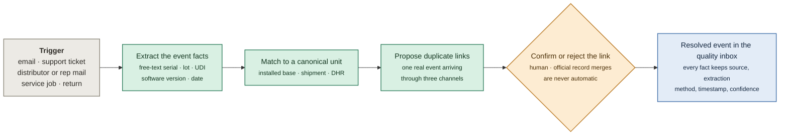
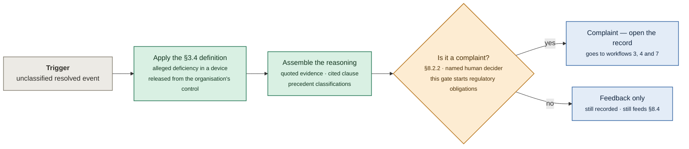
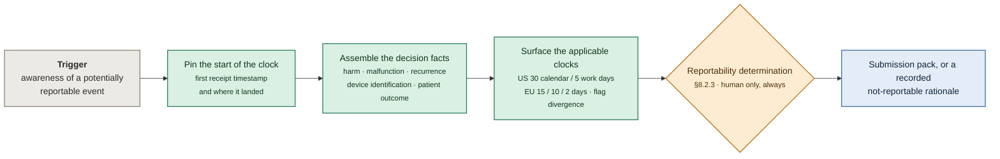
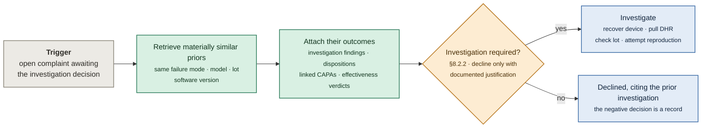
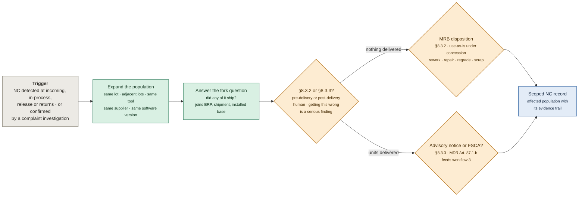
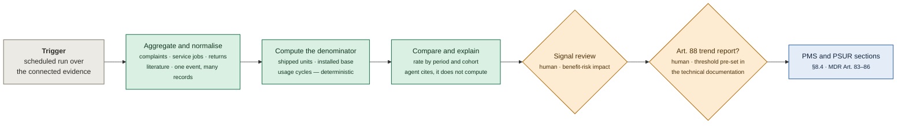
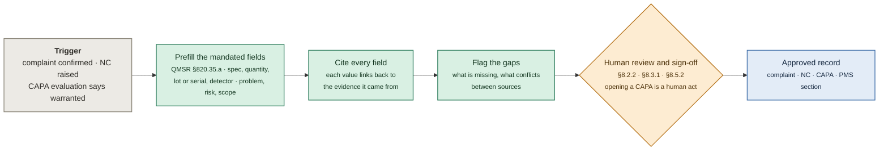
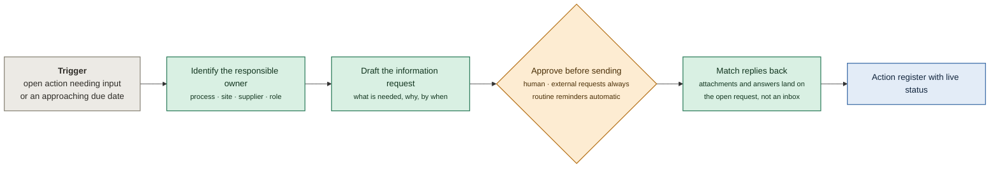
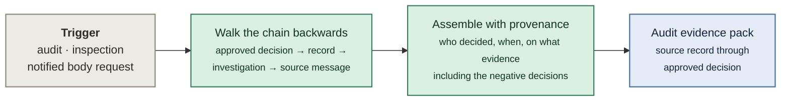

# Agent workflow diagrams

Companion to [`WORKFLOW.md`](WORKFLOW.md). One diagram per agent workflow, in the order they appear in [§9 Where the agent intervenes](WORKFLOW.md#9-where-the-agent-intervenes). Each diagram starts at its own trigger, so no diagram depends on reading another.

| Colour | Meaning |
|---|---|
| ⬜ **grey** | Trigger — an event in the customer's existing tools, or human work the agent does not touch |
| 🟩 **green** | Agent work — Observe, Recommend, or Draft |
| 🟧 **amber** | Human decision — never automated, regardless of confidence |
| 🟦 **blue** | Output — review material, a draft record, or a deliverable |

**The rule the colours encode:** a green node never creates an approved record. It produces evidence, a recommendation, or a draft that a named human accepts, amends, or rejects. The record exists only when a human signs it. The amber gates are the [hard human gates](WORKFLOW.md#hard-human-gates--never-agent-regardless-of-confidence) — they are not candidates for confidence-based automation later.

| # | Workflow | Autonomy | Clause |
|---|---|---|---|
| [1](#1-ingest-and-resolve) | Ingest and resolve | Draft | §8.2.1 |
| [2](#2-complaint-triage-recommendation) | Complaint triage recommendation | Recommend | §8.2.2 |
| [3](#3-reportability-evidence-assembly) | Reportability evidence assembly | Draft | §8.2.3 · Part 803 · Art. 87 |
| [4](#4-precedent-lookup) | Precedent lookup | Recommend | §8.2.2 |
| [5](#5-scope-expansion) | Scope expansion | Draft | §8.3.2 / §8.3.3 |
| [6](#6-trend-detection) | Trend detection | Draft | §8.4 · Art. 88 |
| [7](#7-record-drafting) | Record drafting | Draft | §8.2.2 · §8.3.1 · §8.5.2 |
| [8](#8-coordination) | Coordination | Execute with approval | all lanes |
| [9](#9-evidence-bundle-assembly) | Evidence bundle assembly | Observe | all lanes |

---

## 1. Ingest and resolve

**Trigger:** anything inbound lands in a connected source — no human has to file it first.

Everything downstream reads from the resolved event, so this is the workflow the rest depend on. It is also the hardest: entity resolution across fragmented sources at volume is what a human cannot do reliably. §8.2.1 is the intake net — *all* feedback, not only the subset that turns out to be a complaint.

---

## 2. Complaint triage recommendation

**Trigger:** a resolved event appears in the inbox that has not yet been classified.

The agent buys consistency: the same judgement made the same way every time, with the rationale recorded. The classification itself stays human because it is what starts the regulatory obligations. "Shipment arrived late" is not a complaint; "reading drifted mid-procedure" is.

---

## 3. Reportability evidence assembly

**Trigger:** awareness. Not the end of an investigation — the moment the organisation first holds the information.

This workflow runs on its own statutory clock, in parallel with any investigation — it is never a downstream step, and waiting for the investigation is the single most common place a real QMS takes a finding. The clocks start on awareness, and awareness is scattered across inboxes, so surfacing the start of the clock is the highest-value thing the agent does anywhere.

---

## 4. Precedent lookup

**Trigger:** a complaint record is open and someone has to decide whether to investigate.

§8.2.2 explicitly permits not investigating where a materially similar complaint was already investigated — but only if you can find it and cite it. Retrieval over the full history is exactly what a human cannot do reliably, which is why the justification is usually thin in practice.

---

## 5. Scope expansion

**Trigger:** a nonconformity is detected, or a complaint investigation confirms product is nonconforming.

Containment and segregation happen before any of this — they are physical, immediate, and human. The agent's job starts once the record exists: work out how far the problem reaches. A complaint that confirms a product nonconformity creates a *linked* NC record; it does not merge into the complaint or get absorbed by it.

---

## 6. Trend detection

**Trigger:** continuous. This is a planned aggregation layer above the registers, not a reaction to any single event.

The denominator is the product. Without shipped-unit and installed-base data a trend is only a raw count, and a raw count is not defensible under Art. 88 — where the threshold is a legal commitment made in advance. The calculation is deterministic and reproducible; the model explains and cites it rather than performing it.

---

## 7. Record drafting

**Trigger:** a human decision has just created the need for a record — a complaint confirmed, an NC raised, a CAPA warranted.

This removes transcription, not judgement. The value is not the speed of the draft — it is that every prefilled field carries provenance back to the original evidence, so the reviewer checks a citation instead of hunting for a source. Root cause, effectiveness verdict, and closure all stay human gates inside the CAPA that follows.

---

## 8. Coordination

**Trigger:** an open item needs something from a named person — a reply, an attachment, a decision, a deadline met.

Lowest regulatory risk, highest time saving. This is where quality teams actually lose their days: chasing people, then re-finding the reply three weeks later in a thread. Routine reminders go out automatically; anything leaving the organisation is approved first.

---

## 9. Evidence bundle assembly

**Trigger:** an audit, an inspection, a notified-body request — or any time someone asks "show me the trail".

No gate, because nothing is being decided — this workflow only retrieves. It is Observe-level autonomy, and it works only if the eight workflows above kept their provenance as they went. Audit preparation is recurring, expensive, and purely retrieval-shaped.

---

## Source dependency matrix

Every workflow above reads from the same shared quality context, in which each fact retains its source, extraction method, timestamp, confidence, and review status. Source systems never write directly into a regulated record. This matrix is which source families each workflow actually needs.

| Agent workflow | Comms | Commercial + ops | Product data | Service + returns | QMS of record | External |
|---|:---:|:---:|:---:|:---:|:---:|:---:|
| 1 · Ingest and resolve | ● | ● | ● | ● | | |
| 2 · Triage recommendation | ● | | ● | | ● | |
| 3 · Reportability evidence | ● | | ● | ● | ● | |
| 4 · Precedent lookup | | | | ● | ● | |
| 5 · Scope expansion | | ● | ● | | ● | |
| 6 · Trend detection | ● | ● | ● | ● | ● | ● |
| 7 · Record drafting | | | | | ● | |
| 8 · Coordination | ● | ● | | | ● | |
| 9 · Evidence bundle | | | | | ● | |

The source families, as they exist in the customer's tools today: **comms** — email, support, chat, distributor and rep mail. **Commercial and operations** — CRM, ERP, orders, shipments, installed base. **Product data** — model, lot, serial, UDI, software version, DHR. **Service and returns** — service jobs, repairs, RMAs, replacements. **QMS of record** — complaint, NC and CAPA registers, audit findings, PMS plan, risk file. **External** — literature, regulator notices, similar-device data.

The integration is the moat: the individual workflows are straightforward, but those six families sit across different systems and teams. Trend detection is the only workflow that needs all six, and commercial data is what turns event counts into rates. The human boundary is explicit throughout: no agent path reaches an approved record without a named human decision.
