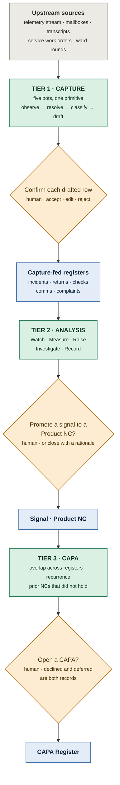
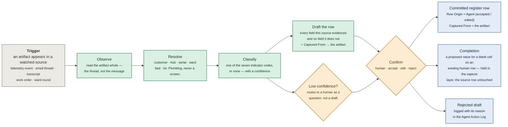
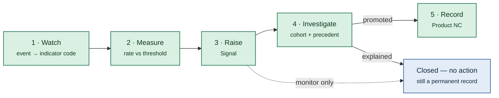
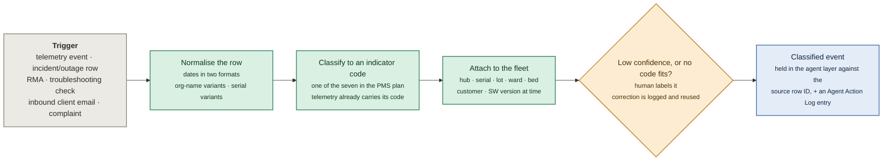
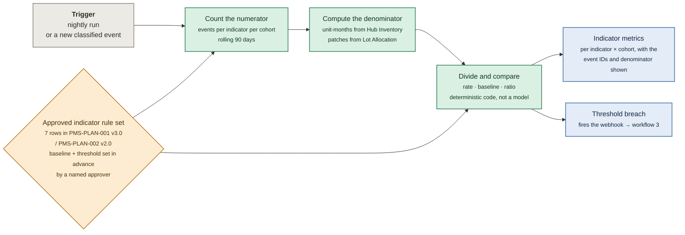
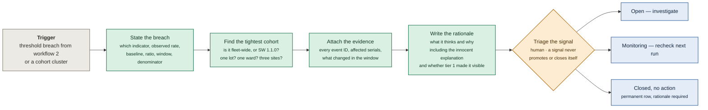
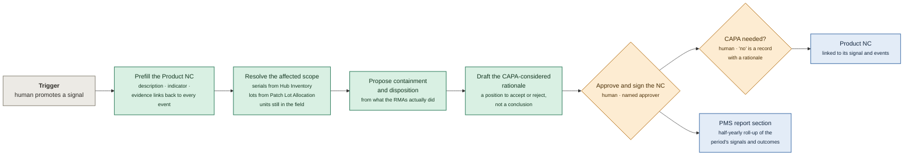

# The three tiers, in diagrams

Companion to [`ARCHITECTURE.md`](ARCHITECTURE.md) (the spine), [`WORKFLOW.md`](WORKFLOW.md) (the domain) and [`REGISTERS.md`](REGISTERS.md) (the tables). One diagram per tier, plus one per tier-2 workflow, each starting at its own trigger.

| Colour | Meaning |
|---|---|
| ⬜ **grey** | Trigger — an event in a source system, or human work the agent does not touch |
| 🟩 **green** | Agent work |
| 🟧 **amber** | Human decision — never automated, regardless of confidence |
| 🟦 **blue** | Output — a register row, a metric, or a draft |

**The rule the colours encode:** a green node never creates an approved record. It produces a classification, a number, a draft, or a recommendation that a named human accepts, amends, or rejects.

---

## The three tiers

Read it downwards and the argument is in the shape: nothing in tier 2 is trustworthy until tier 1 has closed the gap beneath it. The registers correctly identify 53% of the indicator events that actually happened — 62 of 369 have no incident row at all, and of the 307 that do, 197 carry a correct event code. Tier 2 running on that is the same incomplete join the specialist already runs, just faster.

| Tier | Unit of work | Output | Human gate | Writes to |
|---|---|---|---|---|
| **1 · Capture** | one artifact → one or more drafted rows | a drafted row, or a completion for a blank cell | confirm each drafted row | the five capture-fed registers |
| **2 · Analysis** | one indicator × cohort × window | a Signal, then a drafted Product NC | promote signal → NC; approve/close NC | Signal Register · Product NC Register |
| **3 · CAPA** | one failure mode across registers and time | a CAPA recommendation | the CAPA-considered decision | CAPA Register |

---

## Tier 1 · The capture primitive

One diagram for all five bots, because all five are the same shape pointed at a different source. What differs between them is only the source, the register, and how hard the classification is — see [`CAPTURE-AGENTS.md`](CAPTURE-AGENTS.md) for each one field by field.

Four things the diagram is asserting, and each of them is a rule:

**A capture bot never commits a row.** There is no path from a green node to a committed row that does not pass through amber. Capture is autonomy level 3 forever, however good its accept rate gets.

**A blank is a correct answer.** The draft node fills only what the artifact evidences. Outage watch knows the SW version at the moment of the fault because the hub reported it; it does not know who the ward will assign the incident to, and leaves `Assigned To` blank rather than guessing. Guessing to make a row look complete is the failure mode that discredits the whole tier.

**A completion is not an edit.** When a bot has a value for a blank cell on a row a human already wrote, the source row is not touched. The proposal lives in the capture layer with its evidence and downstream analysis reads the completed view — [`REGISTERS.md`](REGISTERS.md) §6.

**Rejection is an output, not an absence.** A rejected draft is a logged record with a reason, exactly as *Closed — no action* is on a signal, because the rejection rate per bot is one of the few honest measures of whether a bot is any good.

---

## Tier 2 · The five workflows

Tier 2 is what the product was before the reframe, unchanged in substance: the NC path, one tier of three.

| # | Workflow | Autonomy | Writes to |
|---|---|---|---|
| [1](#1-watch) | **Watch** — classify an incoming event to an indicator | Automatic | Classified event in the agent layer · Agent Action Log |
| [2](#2-measure) | **Measure** — rate vs baseline vs threshold | Automatic, deterministic | Indicator metrics (computed) |
| [3](#3-raise) | **Raise** — write a Signal when something breaches | Draft | Signal Register |
| [4](#4-investigate) | **Investigate** — precedent, cohort slicing, ask the site | Recommend / Execute with approval | Signal Register · Agent Action Log |
| [5](#5-record) | **Record** — prefill the Product NC and the PMS report section | Draft, human signs | Product NC Register · PMS report |

### How they chain

Most events stop at Measure. That is the correct behaviour, not a failure — a surveillance system that raises a signal per event is as useless as one that raises none.

---

### 1. Watch

**Trigger:** anything lands in a source. No human has to file it first — and after tier 1, a great deal more lands.

Telemetry arrives pre-classified — the hub emits `CONN-LINK-LOSS`, which *is* IND-01's internal code. The work is in the human-authored sources: a troubleshooting row with `Software Issues = "1.1.0 alert logic"` and `Patient & Alert Issues = "6x false RR alert overnight"` is an `ALERT-FALSE` event, and nothing in the row says so. Entity resolution (`RNH` → `Royal North Hospital`, `4111` → `PO-P1-004111`) happens here as plumbing; it is never a screen.

The classification is held **against** the source row, not written into it. The customer's spreadsheet is not edited by any tier — see [`REGISTERS.md`](REGISTERS.md) §6.

---

### 2. Measure

**Trigger:** nightly, and on every newly classified event.

No model runs in this workflow. The human gate is drawn upstream and in amber because it already happened: a named person approved the baseline and the threshold in a controlled document before any of this data existed. That is what makes a breach mean something. The agent may later *explain* a number here; it never produces one.

The numerator is where tier 1 shows up in the arithmetic. The denominator is not: **no capture agent may write to the Hub Inventory or the Lot Allocation sheet**, because a bot that can move the denominator can move every rate in the product.

---

### 3. Raise

**Trigger:** a rate crosses its escalation threshold, or a cluster appears in one lot, one SW version, one site, or one ward.

The cohort slice is the whole value. "IND-04 is up 2.8x" is a number a spreadsheet gives you. "IND-04 is up 2.8x and every contributing event is on SW 1.1.0, across three organisations" is a signal someone can act on. The signal also records `Capture-dependent (Y/N)` — whether it is visible at all without tier 1's drafted rows and completions; on the primary story it is `Y`. *Closed — no action* is a first-class outcome with its own row and rationale: a ward-wide outage caused by hospital network maintenance should be closed, and the record should say so.

---

### 4. Investigate

**Trigger:** a human opens a signal.

```mermaid
flowchart LR
  T["<b>Trigger</b><br/>human opens a signal<br/>from the queue"]
  A1["Precedent lookup<br/><small>prior signals, NCs, RMAs, complaints<br/>same indicator, cohort, component</small>"]
  A2["Slice the cohort<br/><small>SW version · HW rev · lot · site · ward<br/>and the control group that did not breach</small>"]
  A3["Call out the gaps<br/><small>which contributing rows are still<br/>incomplete after capture, and which<br/>artifact could not fill them</small>"]
  A4["Draft the information request<br/><small>to the site contact, naming<br/>the units and the question</small>"]
  G1{"Approve before sending<br/><small>human · every outbound<br/>customer message, always</small>"}
  G2{"Promote to a Product NC?<br/><small>human · or close with a rationale</small>"}
  O["Investigated signal<br/><small>cohort finding · precedent links<br/>request sent · verdict recorded</small>"]
  T --> A1 --> A2 --> A3 --> A4 --> G1 --> G2 --> O
  classDef trigger fill:#eceae5,stroke:#8a8578,stroke-width:1.5px,color:#2e2c27
  classDef agent fill:#d9f0e3,stroke:#2f7d5d,stroke-width:1.5px,color:#12351f
  classDef gate fill:#fdecd2,stroke:#b8761f,stroke-width:1.5px,color:#4a2f07
  classDef out fill:#e3ecf7,stroke:#3f6ea8,stroke-width:1.5px,color:#12253d
  class T trigger
  class A1,A2,A3,A4 agent
  class G1,G2 gate
  class O out
```

Retrieval over the full history is what a person cannot do reliably, and it cuts both ways: the precedent that says "we already investigated this in March and it was patch placement" saves the investigation, and the one that says "we replaced four comms modules for the same fault last quarter" starts it. The missing-data callout changes character after tier 1 — the blanks capture could fill are already filled, so what is left is the honest residue: fields no artifact evidences, and checks that were never done. That residue is a request to a named person, and it is also a tier-1 requirement discovered downstream.

---

### 5. Record

**Trigger:** a human promotes a signal.

This removes transcription, not judgement. Affected scope is the part worth having: "SW 1.1.0" is a version string until it is resolved into named serials at named organisations, which is a join across the hub inventory the specialist would otherwise do by hand in a spreadsheet.

`CAPA considered (Y/N)` here is the hand-off to tier 3. `N` requires a rationale; `Y` is not the same thing as opening one.

---

## Tier 3 · The CAPA sweep

**Trigger:** an NC reaching a terminal status, a signal closed or set to monitoring, and a weekly sweep regardless. Tier 3 does not watch events — it watches the records the tiers above it left behind. The weekly sweep is the one that earns its keep, because the interesting case has no trigger: a mode that recurs while each occurrence is individually closed as too small never fires an event-driven check.

```mermaid
flowchart LR
  T["<b>Trigger</b><br/>an NC reaching a terminal status · a signal<br/>closed or set to monitoring · the weekly sweep"]
  A1["Gather the history<br/><small>signals · NCs · complaints · RMAs<br/>checks · comms · PMS meeting minutes</small>"]
  A2["Test for one failure mode<br/><small>the same thing in three different logs<br/>— or three things that merely look alike</small>"]
  A3["Test for recurrence<br/><small>over what period, in which registers,<br/>and whether the cohort is the same one</small>"]
  A4["Find the prior action<br/><small>the earlier NC, containment or CAPA<br/>that was supposed to have fixed this —<br/>and what it actually did</small>"]
  A5["Draft the recommendation<br/><small>problem statement · recurrence evidence<br/>why the prior action did not hold<br/>affected scope, resolved</small>"]
  G{"CAPA decision<br/><small>human · opened · declined · deferred<br/>rationale mandatory either way</small>"}
  O1["CAPA Register row<br/><small>Status = Open. Investigation, root cause,<br/>effectiveness: human, out of scope.</small>"]
  O2["Declined or deferred<br/><small>a permanent record with a rationale.<br/>Never a deletion.</small>"]
  T --> A1 --> A2 --> A3 --> A4 --> A5 --> G
  G --> O1
  G --> O2
  classDef trigger fill:#eceae5,stroke:#8a8578,stroke-width:1.5px,color:#2e2c27
  classDef agent fill:#d9f0e3,stroke:#2f7d5d,stroke-width:1.5px,color:#12351f
  classDef gate fill:#fdecd2,stroke:#b8761f,stroke-width:1.5px,color:#4a2f07
  classDef out fill:#e3ecf7,stroke:#3f6ea8,stroke-width:1.5px,color:#12253d
  class T trigger
  class A1,A2,A3,A4,A5 agent
  class G gate
  class O1,O2 out
```

The green nodes stop at a drafted argument, and that boundary is the scope line: **tier 3 recommends opening a CAPA and drafts its problem statement; it does not run the investigation, implement the action, verify effectiveness, or close it.** CAPA execution is out of scope and stays out.

The hardest node is A2, and it is hard in both directions. Seventeen RMA rows reading `Battery module replaced, capacity 61% of nominal`, a `BATT` cluster on H1 units that never breaches at fleet level, and a prior signal left on *monitoring* that asked service to record measured capacity — a measurement that was then taken into a register nobody read back against the signal — are plausibly one failure mode, or three unrelated facts about old hardware. Getting that wrong in the generous direction produces a CAPA system nobody trusts. The reasoning is specified in [`CAPA.md`](CAPA.md).

`Why prior action did not hold` is the sharpest field in the register, and it is also a tier-1 finding in disguise: a CAPA that failed because the evidence was thin names the register that was empty, which is a capture requirement discovered from the top of the stack.

---

## The gates that no confidence level may bypass

- Committing any drafted register row (tier 1)
- Classifying an inbound communication as a **complaint** (tier 1 recommends, a human decides)
- Promoting a signal to a Product NC (tier 2)
- Approving and closing a Product NC (tier 2)
- The CAPA-considered decision, and opening a CAPA (tier 3)
- Any outbound customer communication (any tier)

A capture draft rejected, a complaint declined, a signal closed as *no action*, a CAPA declined or deferred — each is a permanent record with a named reviewer and a rationale. Every agent output, in every tier, lands in the Agent Action Log with its tier, its autonomy level and the human's verdict on it.

## Source dependency

All eleven registers ([`REGISTERS.md`](REGISTERS.md)) and the upstream artifacts ([`UPSTREAM-SOURCES.md`](UPSTREAM-SOURCES.md)). **●** reads · **✎** writes or drafts.

| | Upstream artifacts | Orgs & Hubs | PMS Plan | Incidents | Returns | Checks | Comms | Complaints | Signal | Product NC | CAPA | Action Log |
|---|:---:|:---:|:---:|:---:|:---:|:---:|:---:|:---:|:---:|:---:|:---:|:---:|
| **T1 · Outage watch** | ● | ● | ● | ✎ | | | | | | | | ✎ |
| **T1 · Inbox triage** | ● | ● | ● | ● | ● | | ✎ | ✎ | | | | ✎ |
| **T1 · Meeting scribe** | ● | ● | ● | | | | ✎ | ✎ | | | | ✎ |
| **T1 · RMA capture** | ● | ● | ● | | ✎ | | ● | ● | | | | ✎ |
| **T1 · Field-check nudge** | ● | ● | ● | | | ✎ | | | ● | | | ✎ |
| T2 · 1 Watch | ● | ● | ● | ● | ● | ● | ● | ● | | | | ✎ |
| T2 · 2 Measure | | ● | ● | ● | ● | ● | ● | ● | | | | ✎ |
| T2 · 3 Raise | | ● | ● | ● | ● | ● | ● | ● | ✎ | | | ✎ |
| T2 · 4 Investigate | ● | ● | ● | ● | ● | ● | ● | ● | ✎ | ● | ● | ✎ |
| T2 · 5 Record | | ● | ● | ● | ● | ● | ● | ● | ● | ✎ | | ✎ |
| **T3 · CAPA sweep** | | ● | ● | ● | ● | ● | ● | ● | ● | ● | ✎ | ✎ |

Four things the table says that are worth saying in words.

**No agent writes to a reference register.** The `Orgs & Hubs` and `PMS Plan` columns are read-only in every row, across all three tiers. Both denominators and the entire indicator rule set live there.

**Two sources carry everything.** The Hub Inventory and Patch Lot Allocation sheets are read by every workflow and every bot, because both denominators, all entity resolution and all affected-scope resolution come from them. The PMS plan's indicator table is read by everything that has to say what an event *is* or whether a rate is too high — including tier 1, which classifies to the same seven codes.

**Tier 1 is narrow by design.** Each bot writes one register — two for the comms-log pair, plus the complaint recommendation — and reads its own source plus reference data. A capture bot with a wide write surface is a capture bot that can damage a rate.

**Tier 3 reads widely and writes once.** It touches every register and produces one row, which is the correct ratio for a tier whose entire job is an argument about recurrence.
