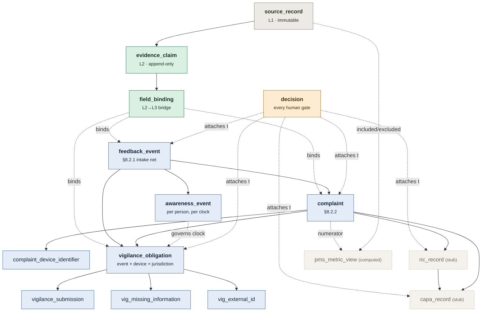

# Register Shapes — V0

**What this is.** The *implemented* shape of the first working product journey: the tables, grains, and roughly 55 attribute columns we actually build. It is a **projection** of the full register reference, not a replacement for it.

```text
  Full register reference                     plan/reference/REGISTER-REF-*.md
  every researched field, every citation,      ~2,700 lines, stays correct,
  every rule, every future obligation          stays comprehensive, grows
                         │
                         │  select
                         ▼
  V0 register projection                      this file
  only what the first journey needs            ~55 attribute columns
                                               every one traceable upward
```

The reference does not get weakened, and we do not build 300 empty form fields. Every field below names the reference section it came from, so widening V0 later is a lookup, not a re-research.

| Reference | Lines | Covers |
|---|---:|---|
| [`reference/REGISTER-REF-complaint-vigilance.md`](reference/REGISTER-REF-complaint-vigilance.md) | 1,145 | Complaint, vigilance, awareness, clocks, trend/PSR/VMSR rows |
| [`reference/REGISTER-REF-nc-capa-audit.md`](reference/REGISTER-REF-nc-capa-audit.md) | 740 | NC, CAPA, audit findings, change control |
| [`reference/REGISTER-REF-document-action-pms.md`](reference/REGISTER-REF-document-action-pms.md) | 781 | Document, training, action, risk, PMS + denominators |

Companions: [`WORKFLOW.md`](WORKFLOW.md) (the domain), [`DIAGRAMS.md`](DIAGRAMS.md) (the nine agent workflows, referenced below as WF 1–9), [`MOCK-DATA.md`](MOCK-DATA.md) (how the source data is generated).

---

## 1. Three layers

```text
Layer 1   RAW SOURCE RECORDS          immutable, messy, source-native
          support tickets · emails · spreadsheets · shipment exports
          device records · service reports · documents
                         │
                         │  extraction (agent, WF 1)
                         ▼
Layer 2   CLAIMS + EVIDENCE           one extracted fact, one provenance trail
          "serial is SN-4471" ← TICKET-1182 comment 3 ← AI ← unreviewed
          "serial is SN-4417" ← EMAIL-0441 body     ← AI ← unreviewed
          both survive. neither wins automatically.
                         │
                         │  human review (amber gate)
                         ▼
Layer 3   QUALITY REGISTERS           controlled business records
          feedback event · complaint · awareness event
          vigilance obligation · (NC · CAPA stubs) · (PMS view)
          every field points back at the claim that justified it
```

This separation matters more than getting any individual field right. It is what makes WF 9 (walk the chain backwards) possible at all, and it is the only reason a drafted record is reviewable rather than merely plausible.

**Rule 1.** Layer 1 is append-only. We never correct a source record; a wrong serial in a ticket stays wrong in the ticket.
**Rule 2.** Layer 2 is append-only. Conflicting claims coexist. Resolution is a Layer-3 act with a named human.
**Rule 3.** No Layer-3 field value exists without a binding to Layer 2 or to a named human who typed it.

---

## 2. The binding table — where three hard requirements get paid for once

The reference ends with four cross-register decisions that every register must honour ([complaint-vigilance §4](reference/REGISTER-REF-complaint-vigilance.md)). Three of them are properties of *a field*, not of a record — so they live in one table instead of being smeared across 55 columns.

A register field is stored twice: as a **scalar column** (so the thing is queryable and exportable like a normal register) and as a **binding row** (so it is defensible).

```text
complaint.date_received = 2026-03-09              ← scalar, for query + export

field_binding
  record            complaint / CMP-2026-0031
  field_path        date_received
  accepted_claim    CLM-0912
  value_state       value | explicitly_unknown | not_yet_investigated
  origin            extracted | computed | human_entered | human_overridden
  override_reason   "ticket creation date is Monday; the mailbox timestamp is Friday 18:40"
  competing_claims  [CLM-0913, CLM-0947]          ← kept, not discarded
  bound_by / bound_at
```

| Reference decision | Where it lands in V0 |
|---|---|
| **#1** Negative decisions are rows with four fields: decision, rationale, named decider, date | `decision` table (§4.8) + terminal states, never a soft delete |
| **#2** Awareness is a set, not a date | `awareness_event` table (§4.4) — a first-class register, not a column |
| **#3** Every field has three empty states, not one | `field_binding.value_state` |
| **#4** Anything an agent computes carries `{computed \| human-overridden}` + a reason | `field_binding.origin` + `override_reason` |

**Why #3 is not optional.** FDA refuses to read a blank as "unknown": *"If the fields are left blank, we cannot determine what information was unknown to you or what information was simply overlooked."* Its own sentinel is the literal string `UNK`. A two-state null cannot satisfy that; three states can. Paying for it at the binding layer costs one enum column instead of 55 nullable ones.

**Why #4 is not optional.** `DIAGRAMS.md`'s colour rule — *a green node never creates an approved record* — becomes a column rather than a convention. `origin` is how an auditor sees which gate applied.

---

## 3. Entity map



---

## 4. Table specifications

Counting rule for the budget in §6: **attribute columns only** — surrogate ids, foreign keys and audit stamps (`created_at`, `created_by`) are excluded, because every table has them and they are not design decisions.

### 4.1 `source_record` — Layer 1

Immutable. One row per addressable thing in a source system. A thread is a record; so is each message in it; so is a ticket; so is each comment on it — parented.

| Field | Type | Notes |
|---|---|---|
| `source_system` | enum: gmail · support · crm · erp · installed_base · service · drive · sheets · slack · calendar | Matches the connector mix in [`mock/asteria.md`](mock/asteria.md) |
| `source_record_id` | string | The id *that system* uses. Never ours. |
| `record_type` | enum: message · thread · ticket · comment · row · sheet · document · attachment · event | |
| `parent_source_record_id` | ref, nullable | Comment 3 of TICKET-1182 |
| `source_locator` | string | `comment[2]`, `B14`, `p.3 ¶2`, `chars 840–902` — how to point at the exact evidence |
| `observed_at` | timestamptz | When the *source system* says it happened |
| `captured_at` | timestamptz | When we ingested it |
| `content_hash` | string | Detects source mutation without mutating our copy |
| `payload_ref` | path | The bytes, stored as-is |

**9 attribute columns.** `MOCK-DATA.md` forbids canonical cross-source ids in the source data, so this table is the first place a cross-source mapping may legally exist.

### 4.2 `evidence_claim` — Layer 2

One row = one asserted fact about one subject, from one place in one source record.

| Field | Type | Notes |
|---|---|---|
| `subject_type` / `subject_ref` | enum + ref | What the claim is about — an event, a person, a device, a register record |
| `field_path` | string | `date_received`, `device_identifier.serial`, `allegation_verbatim` |
| `value` | jsonb | Scalar, or `{from, to}` for an uncertain date — the regulator's own form asks for a **range** when the incident date is unknown (MIR 1.2(b)) |
| `value_state` | enum: value · explicitly_unknown · not_yet_investigated | Reference decision #3 |
| `source_record_id` | ref | |
| `extraction_method` | enum: llm · regex · structured_field · human_typed | |
| `extracted_at` | timestamptz | |
| `confidence` | float 0–1, nullable | Never a reason a human gate was skipped |
| `review_status` | enum: unreviewed · accepted · rejected · superseded | |
| `reviewed_by` / `reviewed_at` | ref / timestamptz | |

**9 attribute columns.** Competing claims are *normal state*, not an error: `SN-4471` and `SN-4417` both sit here until a human picks one, and the rejected one keeps its row.

### 4.3 `field_binding` — Layer 2 → Layer 3

As specified in §2. `record_type`, `record_id`, `field_path`, `accepted_claim_id`, `value_state`, `origin`, `override_reason`, `competing_claim_ids[]`, `bound_by`, `bound_at`.

**6 attribute columns** (`value_state`, `origin`, `override_reason`, `competing_claim_ids`, `bound_by`, `bound_at`).

### 4.4 `feedback_event` — §8.2.1, the intake net

**Grain: one real-world occurrence, before anyone has decided what it is.**

`WORKFLOW.md` §3 is explicit that §8.2.1 is the net and §8.2.2 is the filter. The feedback register holds *all* feedback; the complaint register holds only the subset assessed as complaints. Three channels reporting one event resolve to **one** feedback event with the duplicates linked — that is WF 1, and the merge is a human act.

| Field | Type | Notes |
|---|---|---|
| `event_no` | string | `FB-2026-0188`. Not in date order; see §5.3. |
| `narrative` | text | The occurrence as currently understood |
| `reported_event_date_from` / `_to` | date / date | A **range**. Same field pair everywhere a date is uncertain. |
| `first_received_at` | timestamptz + tz | Earliest evidence of the event reaching Asteria at all |
| `country_of_use` | iso code | ≠ ship-to country. Selects jurisdictions. |
| `customer_org_ref` / `customer_site_ref` / `contact_ref` | refs | Resolved by WF 1, each a binding |
| `product_model_ref` | ref | P1-100 or PP-72 |
| `triage_state` | enum: unclassified · classified · duplicate · void | |
| `duplicate_of_event_id` | ref, nullable | Terminal link, never a deletion |
| `source_record_ids[]` | refs | Every channel this event arrived through |

**11 attribute columns.**

### 4.5 `complaint` — §8.2.2

**Grain: one alleged deficiency, about one device (model, and where known one unit or lot), reported by one complainant, received once.**

The two grain rules, both enforced in code:

1. **Never merge two distinct alleged deficiencies into one row.** One support ticket describing a display fault *and* an adhesion failure produces **two** complaints, linked.
2. **Never let one real-world event become several complaint rows without a recorded link and a recorded human decision.** Three channels, one event, one complaint — which is why `duplicate_of_complaint_id` is a field and not a delete.

| Field | Type | Status | Notes |
|---|---|---|---|
| `complaint_no` | string | Convention | `CMP-2026-0147` |
| `feedback_event_id` | ref | Product | Structurally required: §8.2.1 and §8.2.2 are separate elements, so the complaint must point back at its origin |
| `date_received` | date | **Mandated** — §820.35(a)(2) | The regulated date. Deliberately *not* derived from awareness. The gap between them is the product. |
| `complainant_contact_ref` | ref | **Mandated** — §820.35(a)(4) | Name/address/phone resolve through the contact |
| `complainant_role` | enum: healthcare_professional · patient_lay_user · biomed_engineer · distributor · internal · other | Convention | Gates whether patient fields can ever be filled |
| `allegation_verbatim` | text | **Mandated** — §820.35(a)(5) | The complainant's own words. Any normalised summary is a *claim*, not a column. |
| `product_model_ref` | ref | **Mandated** — §820.35(a)(1) | |
| `intake_channel` | enum: email · phone · support_ticket · service_visit · distributor · sales · chat | Convention | An oral complaint must be documentable |
| `status` | enum, §5.1 | Convention | |
| `owner` | ref to employee | Convention | |
| `reply_text` / `reply_date` | text / date | **Mandated** — §820.35(a)(7) | The field most often empty in real registers |
| `duplicate_of_complaint_id` | ref, nullable | Product | |

**12 attribute columns.** Classification, investigation-required, CAPA-required and closure are **not** columns here — they are `decision` rows (§4.8). That is how the mandated four-field negative-decision shape gets enforced by construction instead of by discipline.

#### `complaint_device_identifier` (child)

§820.35(a)(3) requires *"Any unique device identifier (UDI) or universal product code (UPC), and any other device identification(s)"* — multi-valued, and it must tolerate absent while distinguishing "not provided" from "not applicable".

| Field | Type |
|---|---|
| `scheme` | enum: serial · lot · udi_di · udi_pi · model · catalogue · software_version |
| `value` | string, nullable |
| `value_state` | enum: value · explicitly_unknown · not_yet_investigated |

**3 attribute columns.** For PulsePatch the lot is routinely unknowable — the pouch is in clinical waste — so `explicitly_unknown` is the *normal* value, not a defect.

### 4.6 `awareness_event` — its own table from day one

**This cannot safely be retrofitted.** Different regulatory clocks legitimately run from different awareness events, and which one applies depends on *who* knew.

21 CFR §803.3(b)(2) splits it:

| Clock | Whose knowledge starts it |
|---|---|
| 30-calendar-day (§803.50) | **Any** employee |
| 5-work-day, FDA-requested (§803.53(b)) | **Any** employee |
| 5-work-day, remedial action necessitated (§803.53(a)) | **Only** an employee with management/supervisory responsibility over regulatory, scientific or technical staff, or whose duties relate to collecting and reporting adverse events |

So a sales rep reading a customer email starts the 30-day clock and does **not** start the §803.53(a) 5-day clock. The EU is broader on a different axis — MDCG 2023-3 Q15 includes authorised representatives and outsourced complaint handlers, with no seniority carve-out.

| Field | Type | Notes |
|---|---|---|
| `feedback_event_id` | ref | Awareness attaches to the event, so sibling jurisdiction rows can share it |
| `occurred_at` | timestamptz | |
| `timezone` | tz | Not optional: MDCG 2023-3 Q14 runs the EU period from 00:00:01 the day *after*, so a timestamp 40 minutes either side of midnight moves the deadline by a day |
| `person_ref` | ref to employee | |
| `person_role` | string | As observed in the source, not as asserted by our roster |
| `employee_class` | enum: any_employee · mgmt_over_reg_sci_tech · ae_collection_duties · authorised_representative · outsourced_handler | The field that makes the §803.53(a) clock defensible at all |
| `basis` | enum: complaint_received · ticket_created · mailbox_delivery · regulator_notification · literature · trend_analysis · distributor_report · service_finding | §803.53(a) names trend analysis — this wires WF 6 into a statutory clock |
| `information_known` | text | *What* they knew at that moment. Two people seeing the same email at different times knew different things. |
| `source_record_id` | ref | |

**8 attribute columns.** There is no `awareness_timestamp` column anywhere else in the schema. Selection of the governing event is a `decision` row plus a pointer from `vigilance_obligation`.

### 4.7 `vigilance_obligation` — §8.2.3 / Part 803 / MDR Art. 87

**Grain: one (event × device × jurisdiction).**

A single PulseOne failure in a Dublin ward that also triggers a US malfunction obligation is **two rows**, two clocks, two report numbers, two decision records, and possibly two opposite outcomes:

```text
VIG-2026-0041   PulseOne SN-4471   United States      21 CFR 803      30-calendar-day
VIG-2026-0042   PulseOne SN-4471   Ireland (HPRA)     MDR Art. 87     15-day
```

This is not tidy-mindedness. FDA cited a manufacturer under §803.17(a)(2) because its procedure *"combined language from the requirements of other regulatory or competent authorities with the requirements in 21 CFR Part 803 in a manner that will result in incomplete, inadequate, or even non-reporting."* A single cross-jurisdiction verdict column is a citable defect.

**"Not reportable" is a row, not the absence of one.** It is status `20`, terminal, carrying rationale + named decider + date. And **"not applicable — not marketed here"** is status `90` — because an absent row is indistinguishable from an unasked question.

| Field | Type | Status | Notes |
|---|---|---|---|
| `vig_no` | string | Convention | `VIG-2026-0042` |
| `feedback_event_id` | ref | Product | Lets sibling jurisdiction rows share one event without either owning it |
| `complaint_id` | ref, nullable | **Mandated hand-off** — §820.10(b)(3) | Nullable only for a regulator-initiated report (Art. 87(11)), with a reason |
| `device_identifier_ref` | ref | **Mandated** — §803.52(c); MIR 2.3 | |
| `jurisdiction` | enum: US · IE · NL · AU · … | Mandated in effect | Art. 87(11) directs the report to the Member State where the incident occurred |
| `applicable_regulation` | enum: 21_cfr_803 · mdr_art_87 · mdr_art_88 · tga · national | Mandated in effect | Selects the clock and the form |
| `clock_rules_available` | boolean | Product | **See §5.4.** If false, we show no due date — we do not invent one. |
| `governing_awareness_event_id` | ref | Product | Which awareness event this row's clock runs from |
| `clock_class` | enum (EU): serious_public_health_threat · death · unanticipated_serious_deterioration · other_serious_incident · (US): 30_calendar_day · 5_work_day · vmsr_quarterly · not_reportable | **Mandated** — MIR 1.2(g); §803.50/§803.53 | |
| `rule_version` | string | Product | MDCG guidance is revised; a due date computed under Rev.1 must stay explainable |
| `period_start_at` / `due_at` | timestamptz | Product (computed) | No regulation states a due *date* — they state periods. Both are computed, both are `origin: computed` bindings. |
| `reportable` | enum: yes · no · **uncertain_reporting_anyway** · pending | Mandated in effect | Art. 87(7) *requires* reporting while uncertain. A yes/no enum cannot represent compliance. |
| `reportability_criteria` | jsonb: harm · malfunction · recurrence_likelihood · causality · seriousness | Mandated in effect | Store the **answers**, not just the conclusion |
| `status` | enum, §5.2 | Convention | |

**13 attribute columns.** The reportability *decision* (rationale, decider, date) is a `decision` row — it is a hard human gate and the record must prove a human made it.

#### `vig_missing_information` (child)

§803.52(f)(11)(iii) and §803.50(b)(3) both require you to explain *why* a required field is empty and what you did to fill it. **The register must have a field for "why this field is empty."**

`field_path` · `state` (explicitly_unknown · not_yet_investigated) · `reason` · `request_ref` (→ the information request sent) — **4 attribute columns.**

This is also what drafts the mandated missing-information statement, so WF 3's gap list has a regulated destination rather than being a UI nicety.

#### `vig_external_id` (child)

Three numbering grammars, one containing slashes, one of which is literally the string `Unknown` — MIR 1.1(c) instructs: *"If no reference number is provided by the NCA, please add 'Unknown'."* An identifier column here cannot be a clean opaque key.

`scheme` (internal_ref · fda_report_number · nca_report_number · eudamed_ref · part_806_number) · `value` · `assigned_by` · `assigned_on` · `state` (assigned · pending · unknown · not_applicable) — **5 attribute columns.**

#### `vigilance_submission` (child) — submissions are versions, not rows

§803.56 requires a follow-up to cite the *original* report number; the 3500A instructions are explicit that *"for a follow-up report, the manufacturer report number must be identical to the number assigned to the initial report."*

`submission_seq` · `report_type` (initial · follow_up · combined_initial_final · final_reportable · final_non_reportable · five_day · supplemental) · `channel` · `submitted_at` · `submitted_by` · `ack_state` (pending · accepted · warning · rejected) · `ack_ref` · `payload_ref` — **8 attribute columns.**

A submission that fails is part of the record, not a retry to be forgotten.

### 4.8 `decision` — every human gate, one shape

Reference decision #1: *negative decisions are rows, not absences, and they carry four fields — decision, rationale, named decider, date.* The pattern is consistent across §820.35(a), §806.20(b)(4), MDSAP Tasks 14 and 15, MIR 4.2(b) and ANVISA Art. 121. One table, so it is impossible to record a negative decision without its rationale.

| Field | Type | Notes |
|---|---|---|
| `subject_type` / `subject_id` | enum + ref | feedback_event · complaint · vigilance_obligation · nc_record · capa_record |
| `decision_type` | enum: is_complaint · investigation_required · reportability · governing_awareness · capa_required · link_merge · closure | |
| `outcome` | string | Including the negatives: `not_a_complaint`, `investigation_declined`, `not_reportable`, `no_capa_required` |
| `rationale` | text, **not null** | A negative decision with no rationale is the finding |
| `precedent_refs[]` | refs, nullable | WF 4's output. *"A similar complaint was already investigated"* needs the ref, not just the sentence — free text alone is the thin justification auditors find. |
| `decided_by` | ref to employee, **not null** | **Never an agent.** Hard gate. |
| `decided_at` | timestamptz, **not null** | |
| `agent_recommendation` | jsonb, nullable | What the agent proposed and at what confidence — kept whether accepted or overruled |
| `superseded_by` | ref, nullable | Decisions are amended by superseding, never by editing |

**8 attribute columns.**

`decision_type: link_merge` is how a *rejected* merge proposal survives — evidence that the system was not silently merging official records.

---

## 5. Rules the schema enforces

### 5.1 Complaint states

```text
00 Received  ──┬──▶ 90 Not a complaint        TERMINAL · rationale + decider
               ├──▶ 95 Duplicate of CMP-xxxx  TERMINAL · linked, not deleted
               └──▶ 10 Open
                        ├──▶ 15 Investigation declined   normal path, not an error path
                        └──▶ 20 Under investigation ──▶ 25 Awaiting information
                                                     ──▶ 30 Investigation complete
                                                     ──▶ 40 Pending response
                                                     ──▶ 50 Closed
                                       99 Void / entered in error   TERMINAL
```

Three rules fall out:

1. `90` and `95` are terminal **states**, not deletions.
2. `15 Investigation declined` is a **normal** closure path, explicitly permitted by §820.35(a). It is what WF 4 exists to support.
3. `99 Void` must exist and be distinguishable from `90`. One says *"assessed, and it is not a complaint"*; the other says *"this record should never have existed."* Auditors ask which.

A state the register must **not** have: *"closed pending reportability."* Complaint status and obligation status are independent columns on independent tables.

### 5.2 Vigilance obligation states

```text
05 Awareness recorded        clock running, determination not made
10 Assessment in progress
20 Not reportable            TERMINAL · rationale + decider + date mandatory
30 Reportable — uncertain    Art. 87(7): report anyway. A COMPLIANT state, not a pending one.
35 Reportable
40 Initial submitted   45 Acknowledged   50 Follow-up due   60 Final submitted
70 Closed                    TERMINAL
85 Reopened                  new information changed the determination — the clock restarts
90 Not applicable — jurisdiction   TERMINAL · recorded, never absent
99 Void                      TERMINAL
```

A UI that renders `30 Reportable — uncertain` as "incomplete" teaches the wrong behaviour.

### 5.3 Deadlines move — including earlier

```text
EU due date:
  day 0        = governing awareness date
  period start = day 0 + 1, at 00:00:01 local
  nominal due  = day 0 + N (N = 2, 10 or 15), at 23:59:59 local
  if nominal due is Sat, Sun or a public holiday in that Member State → next working day
  if the period contains fewer than two working days → extend until it does
  if several clocks apply → due = MIN(all applicable)
```

Four consequences a naive implementation will miss, all of which V0 must carry:

1. **A per-Member-State public-holiday calendar.** Ireland and the Netherlands give different due dates for the same event.
2. **Local time zone and local date**, because the period starts 00:00:01 and ends 23:59:59 *local*.
3. **A rule version on every computed deadline.**
4. **Recomputation on new information** — and *a deadline in this register can move earlier.* If the patient dies two days after a 15-day incident, the clock becomes a 10-day clock ending sooner. `due_at` is therefore a computed binding with its own history, never a frozen cell.

MDCG Q14 also forecloses the obvious excuse: *"A delay in submitting an initial report e.g. due to incomplete information provided by the healthcare facility… is not deemed justified."* Art. 87(6) gives the alternative — submit an incomplete initial report, follow up with a complete one. Which is exactly what `vig_missing_information` is for.

### 5.4 We do not invent rules we have not loaded

Asteria is Australian and currently sells in AU, IE and NL ([`mock/asteria.md`](mock/asteria.md)). V0 implements clock rules for **US (21 CFR 803)** and **EU (MDR Art. 87)** only, because those are the two regimes the reference actually verified.

For any other jurisdiction, `clock_rules_available = false` and the product shows **no due date and says why**. That is a truthful product behaviour and a better demo than a fabricated deadline — but it needs a decision, see §8.

### 5.5 Grain invariants (assert these in tests)

| Invariant | Why |
|---|---|
| One `feedback_event` may produce many `complaint` rows | One ticket, several distinct alleged deficiencies |
| Many `source_record` rows may resolve to one `feedback_event` | One event, three channels |
| A `complaint` never becomes an `nc_record` | They are separate registers under separate clauses; the NC is opened **alongside**, linked, never merged |
| A `capa_action.action_type` may be `corrective` or `preventive` — **never** `correction` | Corrections are `nc_disposition` rows. This makes "closing a CAPA on the correction alone" structurally impossible. |
| Every `vigilance_obligation` has exactly one `governing_awareness_event_id` | And several rows may point at different awareness events for the same event |
| No `decision` row exists with a null `rationale` or a null `decided_by` | The four-field negative-decision shape |
| No register field value exists without a `field_binding` | Layer rule 3 |

---

## 6. Field budget

| Table | Layer | Attribute columns |
|---|---|---:|
| `source_record` | 1 | 9 |
| `evidence_claim` | 2 | 9 |
| `field_binding` | 2→3 | 6 |
| `feedback_event` | 3 | 11 |
| `complaint` | 3 | 12 |
| `complaint_device_identifier` | 3 | 3 |
| `awareness_event` | 3 | 8 |
| `vigilance_obligation` | 3 | 13 |
| `vig_missing_information` | 3 | 4 |
| `vig_external_id` | 3 | 5 |
| `vigilance_submission` | 3 | 8 |
| `decision` | 3 | 8 |
| | **Total** | **96** |
| | *of which Layer 3 registers* | **72** |
| | *of which the core journey (feedback → complaint → awareness → vigilance)* | **~55** |

Against ~300 in the full reference. Nothing is lost — it is in `reference/`, cited, and waiting.

---

## 7. Stubs — linked, not implemented

These exist as tables with an id, a number, a status, an owner and their links, so the graph is complete and WF 9 can traverse it. No workflow, no UI, no field detail.

| Stub | V0 columns | What must be preserved even in stub form |
|---|---|---|
| `nc_record` | `nc_no`, `nature_of_nonconformity`, `requirement_not_met`, `delivery_fork` (§8.3.2 / §8.3.3 / mixed), `status`, links | One NC can have **multiple affected populations and multiple dispositions** — so `nc_affected_population` and `nc_disposition` exist as empty child tables now, not as a later migration. A single `authorised_by` column cannot represent three authorisers. |
| `capa_record` | `capa_no`, `capa_type` (corrective · preventive · both), `input_category`, `status`, `effectiveness_criteria`, links | `capa_type` has **no `correction` value**, ever. A `no CAPA required` outcome is a `decision` row with a rationale, not an absent record. |
| `pms_metric_view` | computed, §7.1 | |

### 7.1 PMS as a computed view, not a register

| Field | Notes |
|---|---|
| `observation_period_start` / `_end` | Must have been specified in the PMS plan, not chosen after the fact |
| `product_cohort_key` | Model + hardware revision + software version + market |
| `numerator_count` + `numerator_inclusion_rule` | What was counted *and what was excluded* |
| `denominator_basis` | **The regulator's enum, not ours:** `placed_on_market` · `units_distributed_in_period` · `episodes_of_use` · `active_installed_base` · `cumulative_units_since_doc` · `devices_implanted` · `other` |
| `denominator_value` + `denominator_unit` + `denominator_is_estimate` | Art. 86(1) mandates the denominator and says it is *"an estimate"* |
| `rate` | Derived. Never stored as an input. |
| `baseline_source` + `threshold_value` + `threshold_source_doc` | |
| `included_source_record_ids[]` / `excluded_with_reason[]` | Without this a rate is a number with no audit trail and WF 9 cannot walk backwards |
| `snapshot_at` + `snapshot_seq` | The same period recomputed in March and September gives different numbers. Both are correct as at their snapshot. |
| `human_review_outcome` + `reviewed_by` | |

**Normal code computes. The agent explains the result and retrieves the supporting evidence.** It does not compute the rate.

Two things this buys for free in the demo, both sourced rather than invented:

- **One product family needs two denominator bases with different aggregation rules.** PulsePatch is a consumable → `units_distributed_in_period`, a category where cumulative data is explicitly *not* acceptable. PulseOne is reusable → `active_installed_base` or `episodes_of_use`, where it is. Same register, two rules.
- **Art. 88 thresholds must be committed in advance** in the technical documentation. WF 6 cannot invent one at analysis time; it must *read* one. If Asteria's mock PMS plan is realistically vague, the product's honest output is **"no threshold is specified in the PMS plan"** — and that, not a computed p-value, is the finding.

---

## 8. Deliberately out of V0

| Omitted | Cost of adding later |
|---|---|
| Internal-audit workflow, audit planning, interviews | Low. Audit findings are just another `capa_input` type; the CAPA stub already accepts them. |
| Training register | Low. |
| Document control module | Low. |
| Change control implementation | Low. |
| CAPA execution UI | Low. |
| Hundreds of submission fields rendered upfront (the 24-cell similar-incidents matrix, four UDI fields plus issuing agencies, IMDRF Annex A/B/C/D/E/F/G codes, VMSR bucketing, PSR periods) | Low **because** provenance exists. Each is a `field_binding` against an existing claim. |
| Evidence-pack retrieval (WF 9) | **Nearly free**, and that is the whole argument for paying for Layers 1–2 now. |

The one thing that would be expensive to retrofit is `awareness_event`, which is why it is in V0.

---

## 9. The first demo journey, mapped to the schema

```text
Messy customer email + support ticket        → source_record ×N
AI extracts facts with provenance            → evidence_claim ×N   (serial SN-4471 vs SN-4417)
AI recognises both describe one event        → proposed link, WF 1
Human confirms the relationship              → decision(link_merge) → feedback_event ×1
AI recommends complaint classification       → agent_recommendation on the decision
Human confirms                               → decision(is_complaint) → complaint ×1
AI identifies multiple awareness events      → awareness_event ×3 (rep · support lead · quality)
Separate US and EU assessments appear        → vigilance_obligation ×2, different clocks,
                                                different governing awareness events
AI drafts record + decision packets          → field_binding origin=computed, awaiting human
```

Eight things demonstrated, none of them cosmetic: ingestion, entity resolution, provenance, duplicate detection, regulatory knowledge, deadline awareness, human control, traceable drafting.

The sharpest single beat: the sales rep's Friday 18:40 email starts the US **30-day** clock the moment any employee reads it, but does **not** start the §803.53(a) 5-work-day clock until it reaches someone with AE-collection duties on Monday. Two clocks, two awareness events, one email — and a register with a single `awareness_timestamp` column cannot show it.

---

## 10. Open decisions

1. **Asteria has no US market.** [`mock/asteria.md`](mock/asteria.md) says *"Sells in Australia and selected European markets"*, but the demo journey above needs US + EU, and US is where 1,145 lines of verified research already sit. **Recommendation: add a small US presence to Asteria's profile** — one line in the company model. It unlocks the §803.3(b)(2) asymmetry, which is the single best beat in the demo. The alternative (AU TGA + EU MDR) is faithful to the current profile but needs a fresh research pass on TGA clocks that we do not have.
2. **Does `90 Not a complaint` live on the complaint register or the feedback register?** V0 does both: a terminal complaint state *and* a pointer back to `feedback_event`. Auditors sampling "complaints" should not be handed a pile of non-complaints — but the decision must be retrievable either way.
3. **Which product's signal do we plant?** [`mock/asteria/roster.md`](mock/asteria/roster.md) defers lot codes, serial ranges and date windows until the signal is chosen. §7.1's two-denominator contrast argues for a PulseOne signal (reusable, installed-base denominator, harder and more interesting) over PulsePatch.
4. **Holiday calendars.** V0 needs IE and NL public-holiday tables plus US federal holidays for the work-day count. Small, but a hard dependency of §5.3.

## 11. What this forces on the mock data

Consistent with [`MOCK-DATA.md`](MOCK-DATA.md)'s imperfection model — these are requirements, not accidents:

- **`date_received` must be genuinely disputed.** The email hits the shared quality mailbox Friday 18:40; the ticket is created Monday 09:10; the complaint record opens Wednesday. Generate all three and let them disagree. This is the product's central problem, and a timestamp 40 minutes either side of midnight changes an EU deadline by a day.
- **Serials must arrive mangled.** `P1-100 #4471`, `4471`, `SN 04471` — and at least one pair that is a genuine transcription conflict (`SN-4471` / `SN-4417`) so two claims survive to a human gate.
- **UDIs must be mostly blank.** Nurses do not read UDIs off labels. §820.35(a)(3) requires it anyway. That gap is inspectable and generating it honestly is worth more than generating it clean.
- **Complaint numbers must not be in date-received order**, because numbers are assigned when the record opens and receipt is earlier.
- **At least one event must be reportable in one jurisdiction and not the other**, with two rationales — otherwise the per-jurisdiction grain looks like over-engineering rather than the citable requirement it is.
- **The PMS plan must be realistically vague about its Art. 88 threshold**, not conveniently precise.
