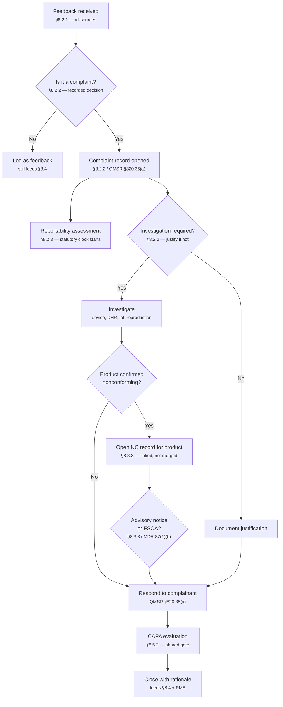
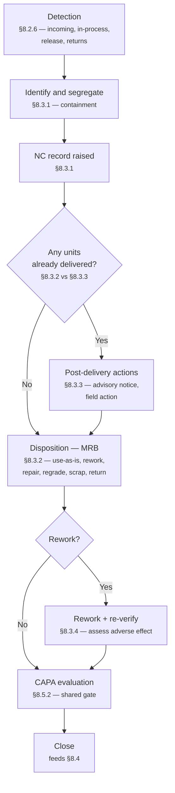

# Quality Workflow Reference

**Purpose.** The canonical, citation-backed shape of the quality workflows this product sits on top of, and the specific points where an agent adds value. This is a reference, not a design doc — [`IDEA.md`](IDEA.md) is the product; this file is the domain it has to be correct about.

**Scope.** ISO 13485:2016 as the QMS backbone, with the US (FDA QMSR + 21 CFR 803) and EU (MDR 2017/745) obligations that attach to it. Every clause number below was verified against a source listed in [Citations](#citations).

**Diagram.** The unified source-to-deliverable system map lives in [`DIAGRAMS.md`](DIAGRAMS.md).

**Standing caveat.** ISO 13485 is a copyrighted standard. Clause numbers and titles are stated here; requirement text is paraphrased, not reproduced. Anyone implementing against this must read the actual standard. CFR and EU MDR text is public and is quoted directly.

---

## 1. The correction

The earlier workflow diagram drew **complaint handling** and **nonconforming product control** as two lanes converging on a single "NCR opened" node, then ran one pipeline through containment, MRB disposition, and CAPA.

That is wrong in one specific, load-bearing way: **it merged two separate clauses with separate registers, separate owners, and separate clocks into one record lifecycle.**

| Old diagram | Reality |
|---|---|
| Complaint lane feeds into "NCR opened" | Complaint records live in the complaint register under §8.2.2. The complaint is the record. An NC record may be opened *alongside* it for affected product — it does not replace or absorb the complaint. |
| Containment / MRB disposition sit downstream of a complaint | Containment and disposition are §8.3 activities about physical product under the organisation's control. A complaint about a device installed in a hospital in Hamburg has no product to quarantine. |
| Reportability drawn as a stage inside the complaint pipeline | Reportability is its own clause (§8.2.3) and runs on a statutory clock in parallel with the investigation. It does not wait for the investigation to finish. |
| CAPA drawn as the pipeline's terminus | CAPA (§8.5.2) is a shared downstream decision that four independent sources can feed. Most inputs never reach it. |
| PMS drawn as a reaction to a complaint | PMS (§8.4 / MDR Art. 83–86) is a planned, continuous aggregation layer *above* the registers, not a step inside one. |

**What the old diagram got right:** most of the individual nodes are real steps. The failure was topology and two labels, not invention.

### 1.1 One refinement to the "complaints never open NCRs" claim

That statement is close but slightly too strong, and an auditor would push on it. The precise position:

ISO 13485:2016 §8.2.2 requires the complaint-handling procedure to cover **handling of complaint-related product**, and §8.3.3 exists specifically for *actions in response to nonconforming product detected after delivery*. So the link between the two lanes **is named in the standard** — it is a documented hand-off, not an ad-hoc practice.

The distinction that matters:

- A complaint **does not** automatically become an NC record.
- When investigation confirms that product is nonconforming — the returned unit, remaining stock of the same lot, or units still in the field — that product is handled under §8.3, and an NC record is opened **for the product**.
- Two linked records, two registers, two closure criteria. Not one merged record.

---

## 2. The real topology

Four independent doors into the quality system. Each has its own lifecycle and closes on its own terms. CAPA is a shared gate they can all feed.

```text
  COMPLAINTS          NONCONFORMING        INTERNAL AUDIT       ANALYSIS OF DATA
   §8.2.2               PRODUCT §8.3          §8.2.4              §8.4  +  PMS
  external            mostly internal       findings            (MDR Art. 83-86)
  post-release        pre-delivery or                           trends, service,
                      post-delivery                             supplier, returns
       |                    |                    |                    |
       |                    |                    |                    |
       +----------+---------+---------+----------+----------+---------+
                                      |
                            +---------v---------+
                            |   CAPA EVALUATION |   §8.5.2 / §8.5.3
                            | "is this systemic?"|
                            +---------+---------+
                                      |
                    +-----------------+-----------------+
                    |                                   |
            No CAPA needed                        CAPA opened
        (rationale documented)              (the minority of inputs)


  Running in parallel, on its own statutory clock, not gated by any of the above:

            VIGILANCE / REGULATORY REPORTING
            ISO 13485 §8.2.3 | 21 CFR 803 | MDR Art. 87-88
```

The vigilance clock is drawn outside the funnel deliberately. It starts on awareness, not on investigation completion, and it is the single most common place a real QMS gets a finding.

---

## 3. Lane A — Complaint handling (§8.2.2)

**Definition.** ISO 13485:2016 §3.4 defines a complaint as a written, electronic, or oral communication alleging deficiencies in the identity, quality, durability, reliability, usability, safety, or performance of a medical device that has been released from the organisation's control — or in a service affecting such a device's performance.

Two consequences worth internalising:

- **Released from control** is the boundary. Product still in the factory is §8.3 territory, not a complaint.
- **Usability** is in the list. "The nurse couldn't read the display in theatre lighting" is a complaint. Use-error is not an automatic exclusion.

### Steps

| # | Step | Clause | Notes |
|---|---|---|---|
| A1 | **Feedback received and recorded** | §8.2.1 | *All* feedback is gathered from production and post-production, not only the subset that turns out to be complaints. §8.2.1 is the intake net; §8.2.2 is the filter. |
| A2 | **Evaluate whether the feedback constitutes a complaint** | §8.2.2 | A formal, recorded decision with a named decider. "Shipment arrived late" — not a complaint. "Reading drifted mid-procedure" — complaint. This gate starts regulatory obligations, which is why it is deliberate rather than implicit. |
| A3 | **Complaint record opened** | §8.2.2, QMSR §820.35(a) | Record content is mandated in the US: device name and identification numbers, date of receipt, complainant contact details, the nature and details of the complaint, corrective action taken, and reply to the complainant. |
| A4 | **Reportability assessment** | §8.2.3, 21 CFR 803, MDR Art. 87 | Runs **in parallel**, on a statutory clock. See §5 below. Never a downstream step. |
| A5 | **Decide whether investigation is required** | §8.2.2 | The standard permits deciding *not* to investigate — typically where a materially similar complaint was already investigated — but requires the justification to be documented. This is a real recorded decision, not a skip. |
| A6 | **Investigate** | §8.2.2 | Recover the device where possible, examine and test, pull the device history record, check the lot, attempt reproduction. QMSR §820.35(a) requires the review, evaluation, and investigation to be recorded. |
| A7 | **Handle complaint-related product** | §8.2.2 → §8.3.3 | The hand-off to Lane B. If product is confirmed nonconforming, §8.3.3 applies and an NC record is opened for the product. |
| A8 | **Advisory notice / FSCA where warranted** | §8.3.3, MDR Art. 87(1)(b) | §8.3.3 requires documented procedures for issuing advisory notices, including records of issue, receipt, and the actions recommended. Field safety corrective actions are separately reportable in the EU. |
| A9 | **Respond to the complainant** | QMSR §820.35(a) | The reply is part of the mandated record content in the US. |
| A10 | **Determine need for correction and/or corrective action** | §8.2.2 → §8.5.2 | The shared CAPA gate. See §7. |
| A11 | **Close with documented rationale** | §8.2.2 | Closure feeds §8.4 analysis of data and the PMS layer. |

### Lane A as a diagram



---

## 4. Lane B — Control of nonconforming product (§8.3)

Four subclauses, and the split is the whole point:

| Subclause | Title |
|---|---|
| §8.3.1 | General |
| §8.3.2 | Actions in response to nonconforming product detected **before** delivery |
| §8.3.3 | Actions in response to nonconforming product detected **after** delivery |
| §8.3.4 | Rework |

### Steps

| # | Step | Clause | Notes |
|---|---|---|---|
| B1 | **Detection** | §8.2.6, §8.3.1 | Incoming inspection, in-process, final release testing, batch record review, or returned-goods inspection. |
| B2 | **Identify and segregate** | §8.3.1 | This is containment. Physically tag and quarantine so the product cannot be used or shipped. Identification and segregation are the point of the clause. |
| B3 | **NC record raised** | §8.3.1 | What failed, against which specification, quantity, lot/serial, who detected it. |
| B4 | **Evaluate extent** | §8.3.2 / §8.3.3 | How many units, same lot, adjacent lots, same tool, same supplier — and critically, **did any already ship?** If yes, §8.3.3 applies and the exposure is now post-delivery. |
| B5 | **Disposition** | §8.3.2, §8.3.4 | The Material Review Board decision: use-as-is under concession, rework, repair, regrade, scrap, return to supplier. Records must capture the nature of the nonconformity, the justification for the disposition, and who authorised it. Rework has its own subclause (§8.3.4) because reworked product must be re-verified against original requirements and the rework's adverse effect assessed. |
| B6 | **Execute and re-verify** | §8.3.4 | Reworked product is re-inspected. |
| B7 | **Post-delivery actions where applicable** | §8.3.3 | Advisory notice, recall, field action. Procedures must be documented and the notices traceable. |
| B8 | **CAPA evaluation** | §8.5.2 | Same shared gate. |
| B9 | **Close** | §8.3.1 | Feeds §8.4. |

### Lane B as a diagram



---

## 5. The vigilance clock (§8.2.3, 21 CFR 803, MDR Art. 87–88)

Drawn separately because it behaves differently from everything else: **it starts on awareness and runs regardless of investigation progress.**

ISO 13485 §8.2.3 requires documented procedures for notifying regulatory authorities where reporting is required by applicable regulation. The regulations themselves set the clocks.

### United States — 21 CFR Part 803

Part 803 remains a **separate regulation** and was *not* folded into the QMSR.

| Report | Trigger | Deadline |
|---|---|---|
| 30-day report (§803.50) | Device "may have caused or contributed to a death or serious injury", **or** has malfunctioned and that malfunction, if it recurred, would be likely to cause or contribute to a death or serious injury | "no later than 30 calendar days after the day that you receive or otherwise become aware of information" |
| 5-day report (§803.53) | "An MDR reportable event necessitates remedial action to prevent an unreasonable risk of substantial harm to the public health", or FDA has made a written request | "no later than 5 work days after the day that you become aware" |

The manufacturer must obtain and submit all information that is "reasonably known", and where information is incomplete, explain why and describe the investigation undertaken.

### European Union — MDR 2017/745 Art. 87

| Situation | Deadline | Source |
|---|---|---|
| Serious public health threat | "immediately, and not later than **2 days** after the manufacturer becomes aware of that threat" | Art. 87(4) |
| Death, or unanticipated serious deterioration in a person's state of health | "immediately after the manufacturer has established or as soon as it suspects a causal relationship... but not later than **10 days**" | Art. 87(5) |
| Any other serious incident | "immediately after they have established the causal relationship... and not later than **15 days** after they become aware of the incident" | Art. 87(3) |
| Field safety corrective action | Reportable in its own right | Art. 87(1)(b) |

### Trend reporting — MDR Art. 88

A distinct obligation, and one that maps almost perfectly onto what this product does. Manufacturers must report any **statistically significant increase** in the frequency or severity of incidents that are *not* serious incidents, or of expected undesirable side-effects, where that increase could significantly impact the benefit-risk analysis. The comparison baseline — the foreseeable frequency or severity — must be specified in the technical documentation and product information.

Art. 88 is the clause that makes "we detected a trend across fragmented sources, with a defensible denominator" a **regulatory obligation** rather than a nice-to-have.

---

## 6. Lane D — Analysis of data and PMS (§8.4, MDR Art. 83–86)

### ISO 13485 §8.4 — Analysis of data

Documented procedures to determine, collect, and analyse data demonstrating QMS suitability and effectiveness. The analysis must cover feedback, conformity to product requirements, characteristics and trends of processes and product including opportunities for preventive action, and suppliers.

### EU MDR — the PMS framework

| Article | Requirement |
|---|---|
| Art. 83 | Plan, establish, document, implement, maintain, and update a PMS system as part of the QMS, proportionate to risk class and device type. Actively and systematically gather data on quality, performance, and safety across the device lifetime. |
| Art. 84 | Document it in a PMS plan, addressing every element of Annex III Section 1.1. The plan is part of the technical documentation. |
| Art. 85 | **Class I** — PMS report, updated when necessary, made available to the competent authority on request. |
| Art. 86 | **PSUR** — Class IIa: updated when necessary and at least every two years. Class IIb and III: at least annually. Class III and implantables: submitted electronically to the notified body via Eudamed. |

Annex III Section 1.1 requires the plan to cover, among other things: data collection processes (complaints, healthcare professional reports, patient feedback, information on similar devices, publicly available information), methods for assessing the collected data, tools for investigating complaints and analysing field experience, **methods and protocols for managing trend reporting under Art. 88 including thresholds for statistically significant increases**, communication protocols with authorities and notified bodies, systematic procedures for corrective action, traceability for field actions, and the PMCF plan or a justification for its absence.

**The structural point:** PMS is an aggregation layer sitting above the registers. It consumes complaints, NC records, service and return data, and external sources, and produces periodic reports and trend signals. It is *not* a step inside complaint handling.

---

## 7. The shared CAPA gate (§8.5.1–§8.5.3)

| Clause | Title |
|---|---|
| §8.5.1 | General (improvement) |
| §8.5.2 | Corrective action |
| §8.5.3 | Preventive action |

§8.5.2 requires action to eliminate the cause of nonconformities in order to prevent recurrence, taken without undue delay and **proportionate to the effects of the nonconformities encountered**. §8.5.3 addresses potential nonconformities, using appropriate risk-assessment methods, proportionate to the potential impact.

"Proportionate" is the word that justifies the gate existing at all. Not every nonconformity earns a CAPA — and a QMS that opens one for everything is as much a finding as one that opens none.

### The distinction the whole domain rests on

From ISO 9000:2015:

| Term | Clause | Meaning |
|---|---|---|
| **Correction** | 3.12.2 | Action to eliminate a *detected nonconformity* — disposal, repair, reprocessing, regrading. Fixes this batch. |
| **Corrective action** | 3.12.3 | Action to eliminate the *cause* of a nonconformity and prevent recurrence. |

Correction can be made before, alongside, or after corrective action. Conflating the two is the single most common conceptual error in this domain, and it is the reason CAPA exists as a separate process rather than as the tail of a disposition.

### CAPA steps

1. **Evaluate** — severity, recurrence, systemic scope, regulatory exposure, benefit-risk impact.
2. **Decide** — open, or document why not. The negative decision is a record.
3. **Investigate root cause** — and record the method.
4. **Plan actions** — corrective and, where applicable, preventive; owners and dates.
5. **Implement under change control** — including document revision and training where the change touches them.
6. **Verify/validate** the actions do not adversely affect the ability to meet regulatory requirements or device safety and performance.
7. **Effectiveness check** against criteria defined *before* implementation.
8. **Close** with an evidence bundle. Feeds §8.4 and management review.

---

## 8. Regulatory backdrop as of 2026

**FDA QMSR.** Effective **2 February 2026**, 21 CFR Part 820 is the Quality Management System Regulation and incorporates ISO 13485:2016 by reference. Only six sections of substantive text remain in Part 820 — scope, definitions, incorporation by reference, QMS requirements, control of records, and device labeling and packaging controls. The old §820.198 complaint-files section is gone; complaint-handling requirements now come from ISO 13485 §8.2.2, with US-specific **record content** mandated by §820.35(a), which opens: "In addition to the requirements of Clause 4.2.5 in ISO 13485..."

**What this means for the product:** ISO 13485 is now the correct single backbone. There is no longer a need to model two divergent QMS clause structures for the US and EU — only the jurisdiction-specific reporting regimes (Part 803 vs MDR Art. 87–88) and the US record-content deltas in §820.35. Worth one sentence in the pitch; it signals currency.

**§820.35 record-content deltas to model explicitly:**

- §820.35(a) — complaint record fields, and records for complaints reportable under Part 803
- §820.35(b) — servicing records: date of service, who performed it, service performed, test data
- §820.35(c) — UDI recorded for each device or batch of devices

---

## 9. Where the agent intervenes

Mapped to the autonomy levels defined in [`IDEA.md`](IDEA.md#action-permission-model).

| # | Intervention | Lane / clause | Autonomy | Why an agent wins here |
|---|---|---|---|---|
| 1 | **Ingest and resolve** — dedupe across email, support, service, distributor; match free-text serials, lots, UDIs, software versions to canonical units | A1 · §8.2.1 | **Draft** — proposes links, never silently merges official records | The same event arrives through three channels as three records. Entity resolution across fragmented sources is the core pain and is genuinely hard for a human at volume. |
| 2 | **Complaint triage recommendation** — apply the §3.4 definition against the text, surface the reasoning and the evidence | A2 · §8.2.2 | **Recommend** — human signs the classification | Consistency. The same judgement made the same way every time, with the rationale recorded. Final classification stays human — it starts regulatory obligations. |
| 3 | **Reportability evidence assembly** — pull the facts a reportability decision needs, surface the applicable clock and its start date, flag jurisdictional divergence | A4 · §8.2.3 / Part 803 / Art. 87 | **Draft** — never decides reportability | The 2/10/15-day and 5/30-day clocks start on *awareness*, and awareness is scattered across inboxes. Surfacing the start of the clock is the highest-value thing here. The decision is always human. |
| 4 | **Precedent lookup** — find materially similar prior complaints, their investigations, dispositions, and CAPAs | A5 · §8.2.2 | **Recommend** | §8.2.2 explicitly permits not investigating where a similar complaint was already investigated — but you have to *find* it and cite it. Retrieval over the full history is exactly what a human cannot do reliably. |
| 5 | **Scope expansion** — same lot, same tool, same supplier, same software version; did any ship? | B4 · §8.3.2/§8.3.3 | **Draft** | The §8.3.2-vs-§8.3.3 fork turns on whether product was delivered. Getting that wrong is a serious finding. Requires joining ERP, shipment, and installed-base data. |
| 6 | **Trend detection with defensible denominators** — rate per shipped unit, per installed base, per usage cycle; period and cohort comparison | D · §8.4 / Art. 88 | **Draft** — deterministic calculation, agent explains and cites | Art. 88 makes this a legal obligation with a threshold defined in the technical documentation. Calculations must be deterministic and reproducible; the model explains and cites, it does not compute. |
| 7 | **Draft records** — NC record, investigation record, CAPA proposal, PMS/PSUR sections — prefilled from resolved context, every field citing its source | A3, B3, CAPA · §8.5.2 | **Draft** | Removes transcription, not judgement. The value is that every prefilled field carries provenance back to the original evidence. |
| 8 | **Coordination** — identify the responsible owner, draft information requests, match replies and attachments back to open requests, chase deadlines | All lanes | **Execute with approval** (requests) / **Automatic** (routine reminders only) | This is where quality teams actually lose time. Low regulatory risk, high time saving. |
| 9 | **Evidence bundle assembly** — reconstruct the full trail from source record to approved decision | All lanes | **Observe** | Audit preparation is a recurring, expensive, purely retrieval-shaped task. |

### Hard human gates — never agent, regardless of confidence

- Final complaint classification (§8.2.2)
- Reportability determination (§8.2.3 / Part 803 / Art. 87)
- Trend report submission decision (Art. 88)
- MRB disposition (§8.3.2)
- Advisory notice / FSCA decision (§8.3.3)
- Opening, approving, and closing a CAPA (§8.5.2)
- Root cause conclusion and effectiveness verdict (§8.5.2)
- Controlled-document approval (§4.2.4)
- Official record merges

---

## 10. Vocabulary that auditors listen for

| Term | Means | Common error |
|---|---|---|
| Feedback (§8.2.1) | All post-market information gathered | Treating only complaints as feedback |
| Complaint (§3.4) | Alleged deficiency in a device released from the organisation's control | Excluding usability issues, or excluding oral reports |
| Nonconformity | Non-fulfilment of a requirement | Using "nonconformity" and "complaint" interchangeably |
| Correction (ISO 9000 3.12.2) | Eliminates the detected nonconformity | Calling containment a "corrective action" |
| Corrective action (ISO 9000 3.12.3) | Eliminates the **cause**, prevents recurrence | Closing a CAPA on the correction alone |
| Preventive action (§8.5.3) | Addresses a *potential* nonconformity | Mislabelling corrective action as preventive |
| Concession / use-as-is (§8.3.2) | Authorised release of nonconforming product | Treating it as routine rather than exceptional and justified |
| Advisory notice (§8.3.3) | Notice issued after delivery advising on use, modification, return, or destruction | Confusing with recall or FSCA |
| Serious incident (MDR Art. 2) | Triggers Art. 87 vigilance reporting | Applying the FDA "serious injury" test to an EU determination |

---

## 11. What changes in the demo

Against the hackathon scope in [`IDEA.md`](IDEA.md#hackathon-product-scope):

1. **Two registers, not one pipeline.** The complaint record and any linked NC record are distinct objects with distinct lifecycles, visibly linked. This alone reads as domain competence.
2. **The vigilance clock is a first-class UI element.** It starts on awareness, shows jurisdiction, and is visible from the moment a complaint record opens — not buried in an investigation step.
3. **Trend detection cites Art. 88.** With an explicit denominator, an explicit baseline, and an explicit observation period. Deterministic calculation, model-written explanation.
4. **Every agent output carries its autonomy level on its face.** Recommend / Draft / Execute-with-approval, shown in the UI, with the hard gates visibly un-automatable.
5. **The correction-vs-corrective-action distinction is enforced in the data model.** A correction record and a corrective action record are different objects. Judges who know the domain will look for exactly this.

---

## Citations

Primary sources verified September 2026.

**Standards (clause numbers verified; text paraphrased — ISO 13485 and ISO 9000 are copyrighted)**

- ISO 13485:2016 official listing — [iso.org/obp](https://www.iso.org/obp/ui/#iso:std:iso:13485:ed-3:v1:en)
- §8.2 subclause structure (8.2.1 Feedback · 8.2.2 Complaint handling · 8.2.3 Reporting to regulatory authorities · 8.2.4 Internal audit · 8.2.5/8.2.6 Monitoring and measurement) — [13485quality.com](http://13485quality.com/iso-134852016-standard-8-2-1-feedback/), [Freyr Solutions](https://www.freyrsolutions.com/blog/understanding-medical-device-complaint-handling-as-per-iso-134852016)
- §3.4 complaint definition — [Elsmar Cove](https://elsmar.com/elsmarqualityforum/threads/iso-13485-2016-complaint-definition-clarity.80094/)
- §8.2.2 procedure content and the documented-justification-for-not-investigating requirement — [ISO 13485 Expert](https://iso13485expert.com/blog/complaint-handling-iso-13485-intake-to-regulatory-reporting/), [Advisera](https://advisera.com/13485academy/blog/2017/03/21/how-to-comply-with-iso-134852016-requirements-for-handling-complaints/)
- §8.3.1–§8.3.4 subclause titles and restructure — [i3C Global](https://www.i3cglobal.com/iso-13485-control-of-nonconforming-product/), [Whittington & Associates](https://www.whittingtonassociates.com/2016/03/iso-134852016/)
- §8.3.3 post-delivery actions and advisory notices — [Advisera](https://advisera.com/13485academy/blog/2017/04/11/iso-134852016-nonconforming-product-how-to-approach-the-post-delivery-actions/)
- §8.3.4 rework — [i3C Global](https://www.i3cglobal.com/iso-13485-rework/)
- §8.4 analysis of data, §8.5.1–§8.5.3 improvement/CAPA — [13485store.com](https://13485store.com/iso-13485-requirements/8-measurement-analysis-and-improvement/), [i3C Global](https://www.i3cglobal.com/iso-13485-corrective-and-preventive-action/)
- ISO 9000:2015 §3.12.2 correction / §3.12.3 corrective action — [QMS Templates](https://qmsdoc.com/2026/01/14/the-difference-between-correction-and-corrective-action-iso-90002015-definitions-and-practical-application/), [Quality Gurus](https://www.qualitygurus.com/correction-corrective-action-and-preventive-action/)

**United States**

- FDA Quality Management System Regulation (QMSR) overview and 2 Feb 2026 effective date — [FDA](https://www.fda.gov/medical-devices/postmarket-requirements-devices/quality-management-system-regulation-qmsr), [FDA QMSR FAQ](https://www.fda.gov/medical-devices/quality-management-system-regulation-qmsr/quality-management-system-regulation-frequently-asked-questions)
- Which Part 820 sections remain — [Greenlight Guru](https://www.greenlight.guru/blog/qmsr-your-guide-to-part-820), [BSI Compliance Navigator](https://compliancenavigator.bsigroup.com/en/medicaldeviceblog/the-new-fda-21-cfr-part-820--quality-management-system-regulation/)
- 21 CFR §820.35 Control of records (complaint records, servicing records, UDI) — [Cornell LII](https://www.law.cornell.edu/cfr/text/21/820.35)
- 21 CFR §803.50 — 30 calendar days — [Cornell LII](https://www.law.cornell.edu/cfr/text/21/803.50)
- 21 CFR §803.53 — 5 work days — [Cornell LII](https://www.law.cornell.edu/cfr/text/21/803.53)

**European Union**

- MDR 2017/745 Art. 87 — 15 / 10 / 2 day deadlines, FSCA reporting — [Medical Device Regulation](https://www.medical-device-regulation.eu/2019/07/16/mdr-article-87-reporting-of-serious-incidents-and-field-safety-corrective-actions/), [Medical Device HQ](https://medicaldevicehq.com/documentation/mdr-article-87-reporting-of-serious-incidents/)
- MDR Art. 88 trend reporting — [Medical Device Regulation](https://www.medical-device-regulation.eu/2019/07/16/mdr-article-88-trend-reporting/), [TÜV SÜD](https://de-mdr-ivdr.tuvsud.com/Article-88-Trend-reporting.html)
- MDR Art. 83–86 PMS framework, PSUR frequencies, Annex III contents — [Zechmeister Solutions](https://zechmeister-solutions.com/en/blog/mdr-articles-83-86-pms-framework), [Emergo by UL — PMS and PSUR whitepaper](https://www.emergobyul.com/sites/default/files/2024-04/PMS-and-PSUR-Requirements-Under-European-MDR.pdf)
- MDCG 2023-3 Rev.2, vigilance Q&A — [European Commission](https://health.ec.europa.eu/document/download/af1433fd-ed64-4c53-abc7-612a7f16f976_en?filename=mdcg_2023-3_en.pdf)

### Confidence notes

- **High confidence:** all CFR and MDR text (quoted from primary or near-primary sources); ISO 13485 clause numbers and titles (corroborated across multiple independent sources); QMSR effective date and remaining-section list.
- **Paraphrased, not verified verbatim:** ISO 13485 requirement wording — the standard is paywalled. Clause numbers are reliable; exact phrasing should be checked against a purchased copy before any of this text appears in a customer-facing compliance claim.
- **Corrected during research:** ISO 9000:2015 assigns **3.12.2 to correction** and **3.12.3 to corrective action** — the reverse of a common misstatement.
- **Not covered here:** IVDR 2017/746, MDSAP, Health Canada, TGA, PMDA, and the UK post-Brexit regime. The architecture in `IDEA.md` should not hard-code MDR-specific reporting logic.
